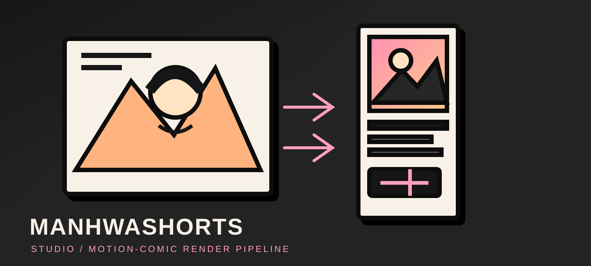

# ManhwaShorts Studio

<p align="center">
  
</p>

<p align="center">
  <strong>Rights-aware motion-comic renders for vertical video.</strong><br>
  Turn authorized panels + commentary into an editable, review-first 9:16 Short.
</p>

<p align="center">
  <a href="#quick-start">Quick start</a> ·
  <a href="docs/INDEX.md">Documentation</a> ·
  <a href="docs/STATUS.md">Current status</a> ·
  <a href="docs/COPYRIGHT.md">Rights model</a>
</p>

## What ships

```text
authorized material → analysis → English script → American English VO
                    → motion timeline → subtitles → QC → MP4 review
```

- Five-beat commentary: hook, setup, conflict, twist, CTA.
- Deterministic camera motion, crop, transitions, effects, and panel cooldown.
- Audio is the timeline clock; subtitles follow measured speech.
- CPU-first FFmpeg render: `1080×1920`, `30 FPS`, H.264/AAC.
- Human approval before publication. Rights failures block release.
- Offline defaults. BYOK LLM/TTS providers are optional.

## Project rules

- **Default text:** English.
- **Default voice:** American English (`en-US`).
- **Default voice ID:** `the-explainer-american`.
- Indonesian is explicit opt-in: set `language: "id"` and an Indonesian `voice_id`.
- Never treat a fixture or user-provided panel as publication-cleared.
- No scraping, watermark removal, generative replacement, or automatic public upload.
- A render is a review artifact until source rights, script approval, and QC pass.

## Quick start

Requirements: Python `3.11+`, FFmpeg/FFprobe with `libass`, a subtitle font, and
optional `espeak-ng` for offline narration.

```bash
git clone https://github.com/yxxrn/manhwashorts-studio.git
cd manhwashorts-studio
python3 -m venv .venv
.venv/bin/pip install -r requirements-dev.txt
cp .env.example .env
.venv/bin/python -c "from app.services.render import check_environment; print(check_environment() or 'environment OK')"
.venv/bin/python -m uvicorn app.main:app --reload
```

Open `http://127.0.0.1:8000`.

### Offline demo

```bash
.venv/bin/python scripts/make_fixtures.py
.venv/bin/python scripts/seed_demo.py --render
```

Fixtures are synthetic and test-only. Do not publish their output.

## Configuration

All settings are optional. Important defaults:

| Variable | Default | Purpose |
|---|---|---|
| `MS_TTS_PROVIDER` | `espeak` | `espeak`, `http`, or `null` |
| `MS_LLM_PROVIDER` | `rules` | Offline rules or BYOK-compatible LLM |
| `MS_REQUIRE_RIGHTS_DECLARATION` | `true` | Require owner + licence basis |
| `MS_ALLOW_PUBLIC_PUBLISH` | `false` | Keep public upload disabled |
| `MS_VIDEO_ENCODER` | `auto` | Resolve CPU/GPU encoder per job |

For paid or higher-quality narration, configure a BYOK provider. Keep provider,
model, voice ID, locale, speed, and voice controls fixed across all beats.

## Architecture

```text
FastAPI UI/API
      │
      ├── ingest → rights metadata
      ├── analysis → script → TTS
      ├── timeline → subtitles → FFmpeg
      └── quality/policy → review/publish gate

SQLite + content-addressed filesystem
```

The app is intentionally boring: small services, local storage, no required GPU,
no mandatory cloud account. A standalone worker is available for render jobs:

```bash
.venv/bin/python scripts/worker.py
```

## Validation

```bash
.venv/bin/ruff check app tests scripts alembic
.venv/bin/python -m compileall -q app tests scripts alembic
.venv/bin/python -m pytest -q -m 'not slow'
.venv/bin/python -m pytest -q
git diff --check
```

Slow tests execute FFmpeg and inspect codecs, dimensions, timing, captions, audio,
black frames, and drift.

## Documentation

Start here: **[Documentation index](docs/INDEX.md)**.

- [Current status](docs/STATUS.md) — implemented, pending, and explicit blockers.
- [Architecture](docs/ARCHITECTURE.md) — services, data flow, and invariants.
- [Motion-comic pipeline](docs/MOTION_COMIC.md) — director, renderer, QC.
- [Operations](docs/OPERATIONS.md) — run, recover, back up, verify.
- [Release runbook](docs/RELEASE_RUNBOOK.md) — production checklist.
- [API reference](docs/API.md) — endpoints and payloads.
- [BYOK](docs/BYOK.md) — encrypted provider keys.
- [TTS options](docs/TTS_OPTIONS.md) — voice-provider selection rules.
- [UI](docs/UI.md) — design system and accessibility constraints.
- [Visual selection](docs/VISUAL_SELECTION.md) — panel scoring and focus.
- [GPU rendering](docs/GPU.md) — optional encoder acceleration.
- [Copyright](docs/COPYRIGHT.md) — rights gate and limitations.
- [YouTube setup](docs/YOUTUBE_SETUP.md) — OAuth and private-by-default upload.
- [Agent operation](docs/AGENT.md) — API-driven execution.
- [Changelog](CHANGELOG.md) — release history.

## Scope boundary

OmniVoice Studio is an external voice experiment, not a ManhwaShorts dependency or
production provider. The core project keeps a generic HTTP TTS adapter so a
validated provider can be selected later without coupling the render pipeline to
one model.

## License and rights

The repository code is provided for project use. Third-party fonts, models, panel
art, and provider services retain their own licences. Verify every licence before
commercial publication. This project does not provide legal advice.

## Status

Development / review-only. The pipeline is technically exercised; production
publication remains blocked until a real source has a verified rights declaration.
See [docs/STATUS.md](docs/STATUS.md).

Maintainer: [yxxrn](https://github.com/yxxrn)

Repository: [github.com/yxxrn/manhwashorts-studio](https://github.com/yxxrn/manhwashorts-studio)

License: see repository notices and third-party asset licences.
